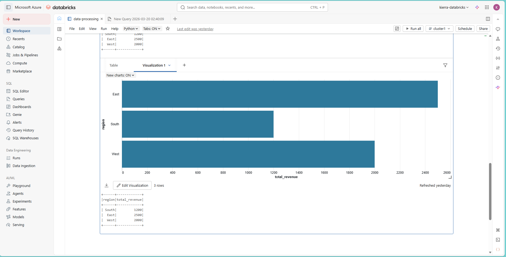
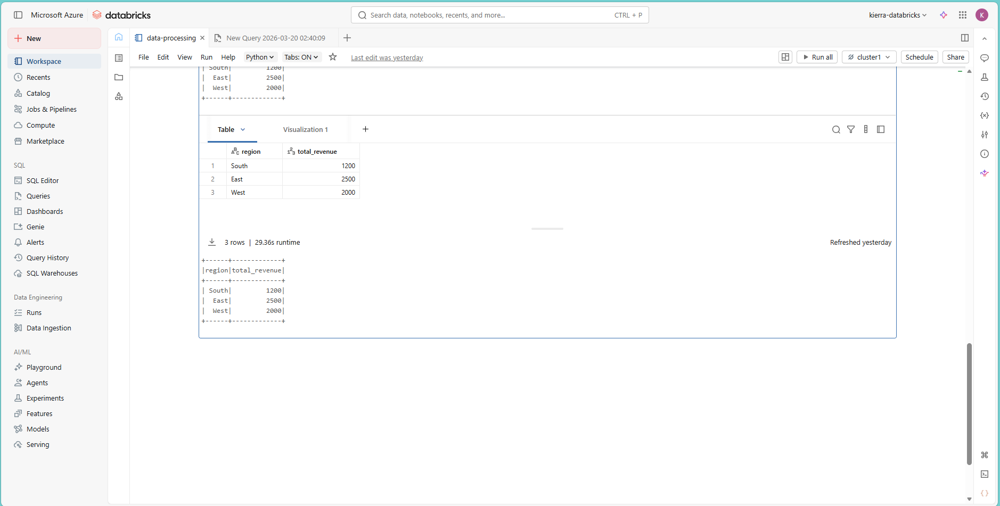
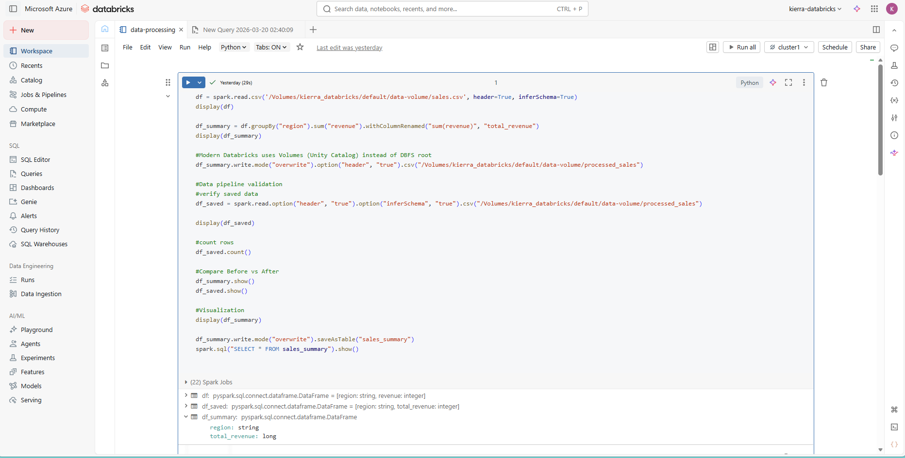

# 🚀 Azure Databricks Sales Pipeline

## 📌 Overview
This project demonstrates an end-to-end data pipeline built using Azure Databricks and PySpark to process and analyze sales data.

The pipeline ingests raw data, transforms it into meaningful insights, and stores the results for downstream analytics and visualization.

---
## Business Problem

Organizations often rely on fragmented spreadsheets and delayed reporting, limiting visibility into sales performance and slowing executive decision-making.

## Solution

Built an end-to-end analytics pipeline that centralizes raw sales data, transforms it into business-ready datasets, and supports dashboard reporting for leadership teams.

## Architecture

Source Data → Azure Data Factory → Azure Data Lake → Azure Databricks → Curated Tables → Power BI Dashboard

---

## 🔄 Pipeline Workflow

### 1. Data Ingestion
- Loaded CSV data from Unity Catalog Volume  
- Used Spark DataFrame API for scalable processing  

### 2. Data Transformation
- Grouped data by region  
- Aggregated total revenue  

### 3. Data Storage
- Saved processed data back to Volume  
- Stored results as a queryable table (`sales_summary`)  

### 4. Data Validation
- Reloaded saved data  
- Verified row counts and outputs  

### 5. Visualization
- Created bar chart showing revenue by region  

---

## 📊 Results

| Region | Total Revenue |
|--------|-------------|
| East   | 2500        |
| West   | 2000        |
| South  | 1200        |

---

## 📸 Project Screenshots

### 📊 Dashboard

### 📈 Processed Output

### 💻 Pipeline Code

---

## 🧰 Technologies Used
- Azure Databricks  
- Apache Spark (PySpark)  
- Unity Catalog (Volumes)  
- Power BI (for visualization)

---

## Business Impact

- Reduced manual reporting effort
- Improved data freshness and trust
- Faster sales performance insights
- Scalable architecture for future growth

## Sample KPIs

- Revenue by Region
- Monthly Sales Growth
- Product Performance
- Rep Productivity
- Forecast vs Actuals

## Future Enhancements

- Real-time streaming ingestion
- AI forecasting models
- Automated anomaly detection
- Executive alerting workflows

## 👩🏽‍💻 Author

Built by Kierra Jenkins as part of an Azure + AI Business Engineering portfolio.
